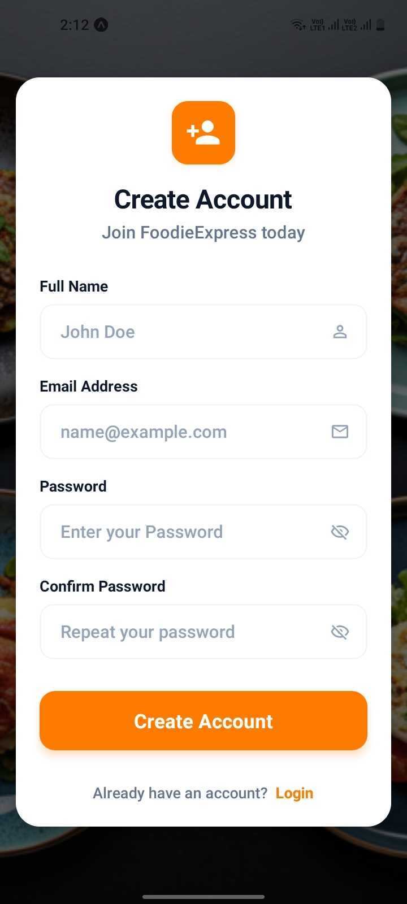
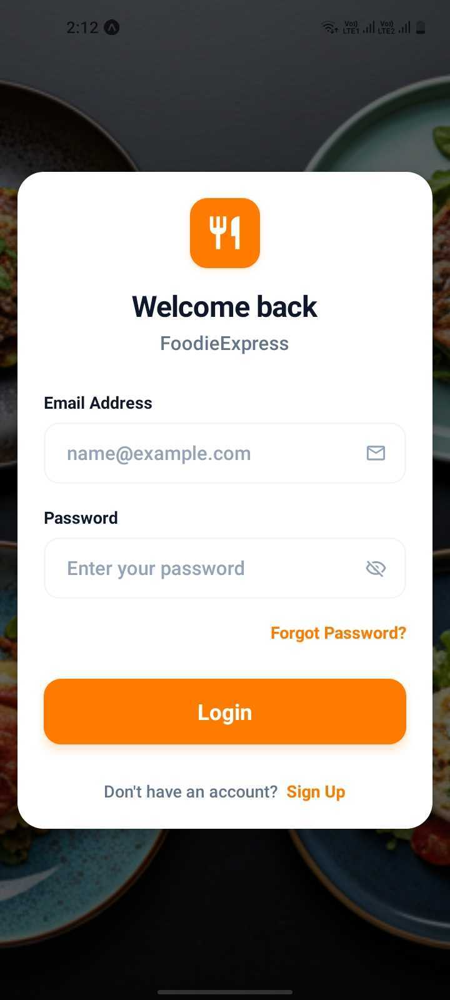
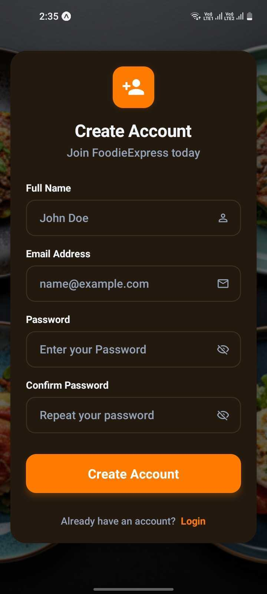
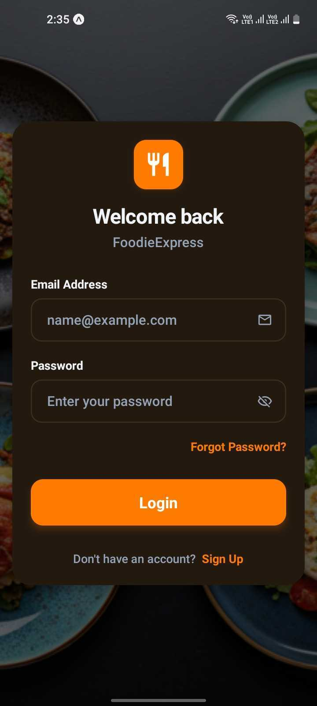

# FoodieExpress 🍔

FoodieExpress is a premium, modern food ordering mobile application built with **React Native** and **Expo**. It offers a seamless experience for browsing categories, managing a cart, and placing orders with ease.

---

## ✨ Features

- 🍕 **Browse Categories**: Filter through your favorite food types (Pizza, Burgers, Sushi, and more).
- 🛒 **Intuitive Cart**: Effortlessly add items, adjust quantities, and manage your order.
- 🔐 **Authentication**: Secure login and signup powered by Firebase.
- 📱 **Smooth Transitions**: Powered by React Native Reanimated for a premium feel.
- 🌗 **Responsive Design**: Full support for iOS and Android with Light and Dark mode.

---

## 📸 Screenshots

### ☀️ Light Mode
<div align="center">
  
  
</div>

### 🌙 Dark Mode
<div align="center">
  
  
</div>


---

## 🛠️ Tech Stack & Libraries

This project leverages industry-standard libraries for performance and scalability:

- **Core Framework**: [React Native](https://reactnative.dev/) & [Expo](https://expo.dev/)
- **Navigation**: [Expo Router](https://docs.expo.dev/router/introduction/) (File-based routing)
- **State Management**: React Context API
- **Backend/Database**: [Firebase](https://firebase.google.com/) (Authentication & Firestore)
- **Styling**: Native Flexbox with dynamic theme support
- **Animations**: [React Native Reanimated](https://docs.swmansion.com/react-native-reanimated/) & [Expo Haptics](https://docs.expo.dev/versions/latest/sdk/haptics/)
- **Data Persistence**: [@react-native-async-storage/async-storage](https://react-native-async-storage.github.io/async-storage/)
- **UI & Assets**: [@expo/vector-icons](https://icons.expo.fyi/), [expo-image](https://docs.expo.dev/versions/latest/sdk/image/), [expo-symbols](https://docs.expo.dev/versions/latest/sdk/symbols/)

---

## 🚀 Getting Started

Follow these steps to set up and run the project locally.

### 1. Prerequisites
Ensure you have **Node.js** (v18+) and **npm** installed. You will also need the **Expo Go** app on your mobile device or an emulator.

### 2. Clone and Install
```bash
# Clone the repository
git clone https://github.com/11saran/Food-Ordering-Mobile-App.git

# Navigate to the project directory
cd Food-Ordering-Mobile-App

# Install dependencies
npm install
```

### 3. Run the Application
Start the Expo development server:
```bash
npx expo start
```

### 4. Viewing the App
- **Mobile**: Scan the QR code in your terminal using **Expo Go** (Android) or the Camera app (iOS).
- **Emulator**: Press `a` for Android or `i` for iOS.

---

<p align="center">Made with ❤️ by Saran</p>
